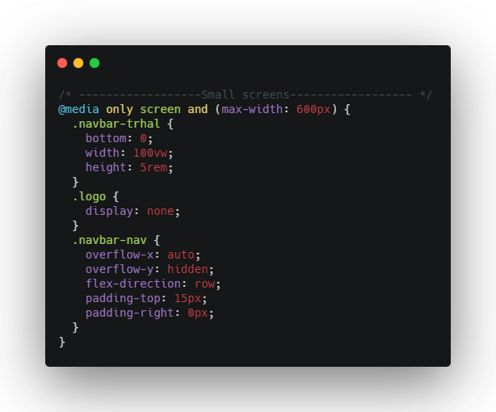
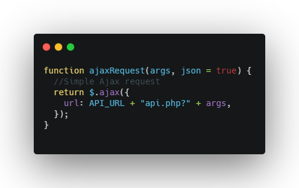
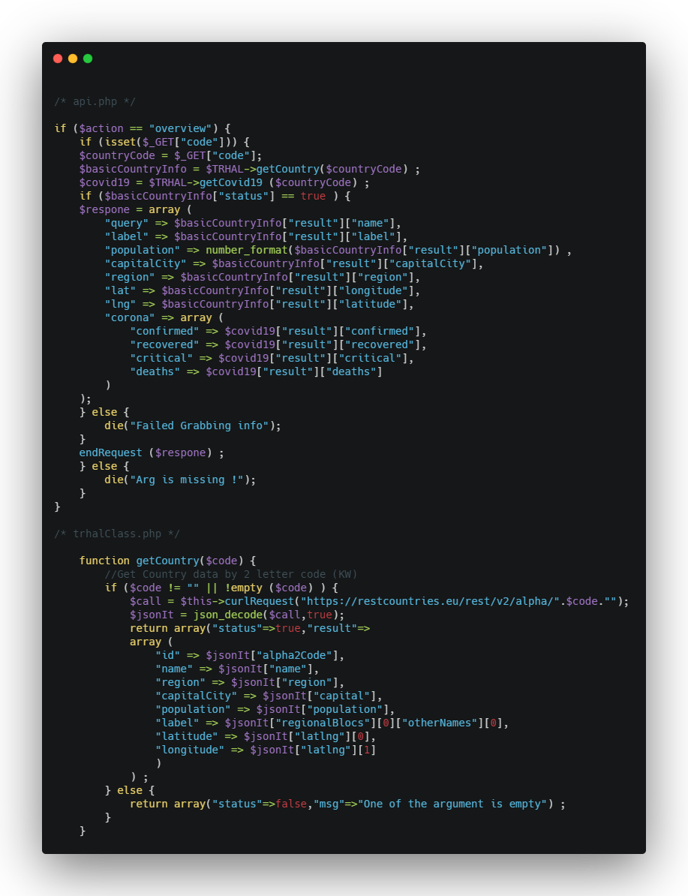
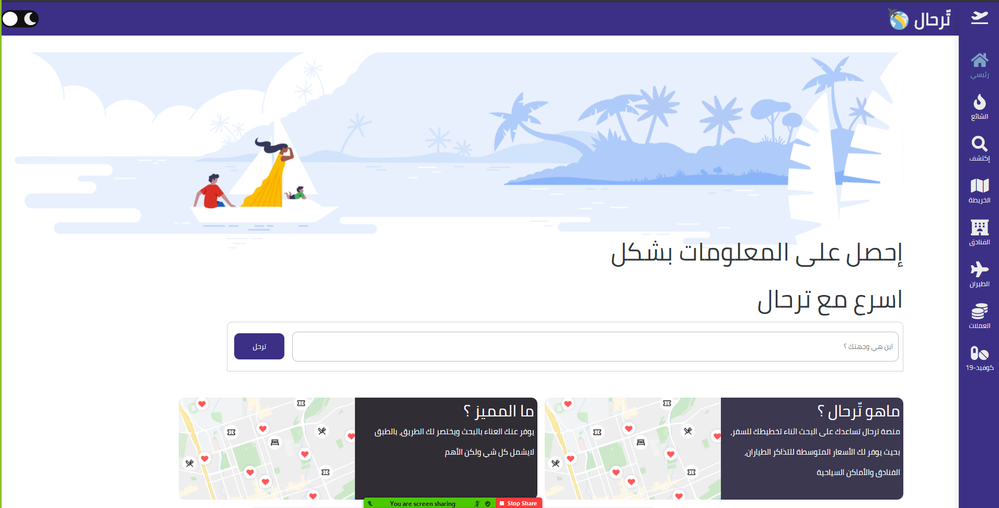
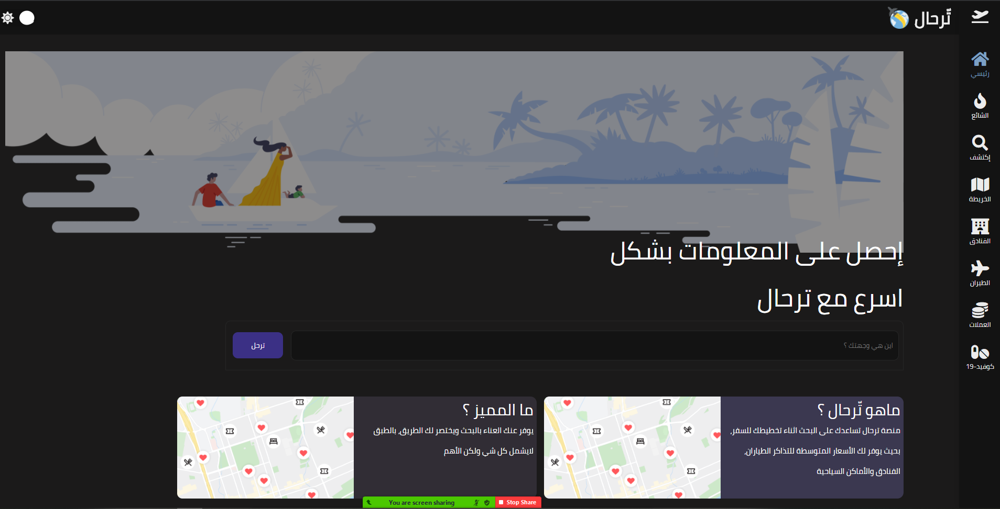
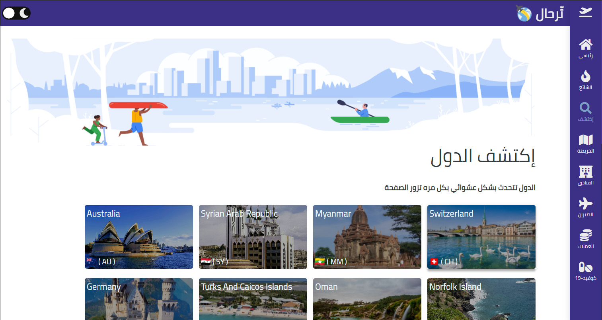
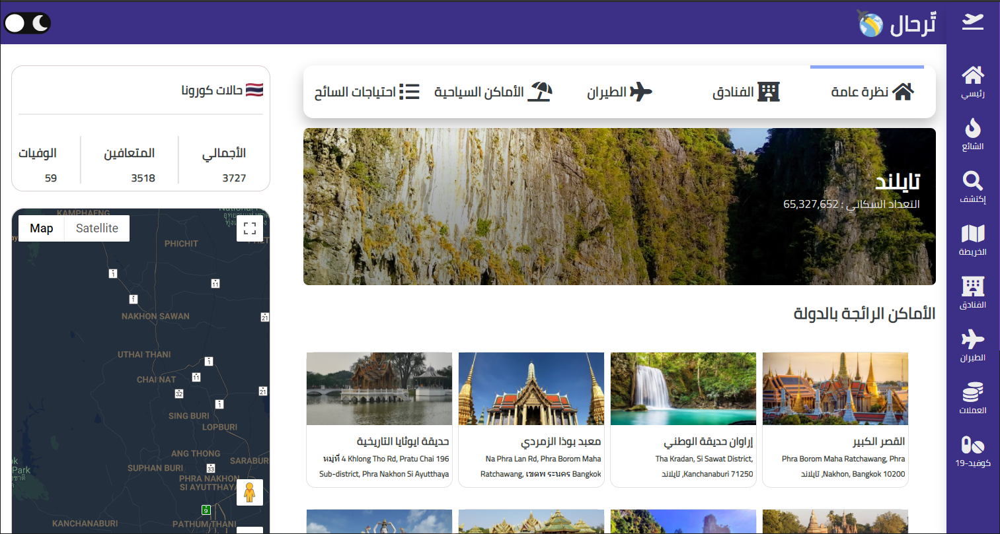
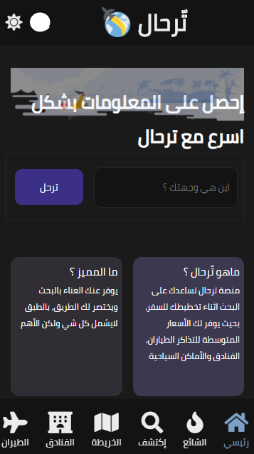

# ✈ تّرحال
## محتويات الوصف
* [نظرة عامة](#نظرة-عامة)
* [المبدأ](#المبدأ)
* [التبيث](#التبيث)
* [التجربة والعرض](#التجربة-والعرض)

## نظرة عامة
فكرة التطبيق : موقع يجلب لك المعلومات التي تحتاجها كشخص مسافر او فضولي
المعلومات الي نوفرها هي : الفنادق، الطيران ، الأماكان السياحية ، حالات كورونا بالدول 
والعديد من المعلومات بتفاصيلها

## المبدأ
### 💻 الأن دعنا من الأمور السطحية، فلنتعمق بطريقة عمل الموقع
الموقع مبني على ثلاث افكار رئيسية (Responsive , Ajax , API ) 
### Responsive
تم بقدر الإمكان إنشاء مكتبة مصغرة وجعلها مناسبة لجميع الشاشات دون إستعمال
مكتبات تصميم خارجية (وذلك بفضل Flexbox) والأكواد التي تقوم بالعمل هذا موجودة في صفحة الرئيسية للتصميم وايضا كل صفحة من الصفحات تحتوي 
على اكواد تصميم معينة لضمان تحقيق هدف تعدد الشاشات، امثلة على الأكواد

### Ajax
للتواصل بين الخادم المزود بالمعلومات والموقع تم إستخدام تقنية (أجاكس) لسهولتها وفعاليتها
جميع الريكوست بالموقع تمر عبر فنكشن واحد بسيط والردود الصادرة من (API) تكون إما JSON PLAN او HTML

### API
من اكثر الأشياء التي تزعج المبرمجين كيف جمع مصادر مختلفة من المعلومات بمكان واحد وتييسر الوصول إليه، 
لذلك قمت بإنشاء (API) يجمع لي جميع المصادر المختلفة بمكان واحد
المصادر هي (<a href="https://developers.google.com/maps/documentation">Google Maps API</a>, <a href="https://rapidapi.com/">Rapid API</a>, <a href="https://www.kiwi.com/en/">SkyPicker</a>)
وبأمكانك تصفح مجلد (v1) لروئية كيفية عمل (PHP API) المصغر
مثال : 

## التبيث

### Install Frontend
بأمكانك تحميل محتويات الملف (Public) على جهازك وإستخدام الموقع مباشرة
(ماعليكم سهلت الموضوع لكم)

### Install Backend
لقد قمت بتجهيز لكم سيرفر مرفوعه به ملفات (PHP API) 
لذلك ان وددت ان تثبت الموقع على جهازك الشخصي إما ان تستخدم (xampp,apache in linux,,etc) 
او تستخدم السيرفر المرفوع والجاهز (كما هو مفترض في main.js) 

<a>https://trhal-api.com</a>

ملاحظة : هذا الرابط للملفات (Backend) بس يعني تحت رابط الموقع كامل 

### او الخيار السهل 
انك تروح للديمو وتدش الموقع دايركت بدون ماتعور راسك

## التجربة والعرض
### 👋أهلا بك وصلت لأخر شي عسى ماطولت عليك <a href="https://trhal.netlify.app/">رابط الموقع</a>

<strong>Website screenshots</strong>
 
    

 

    
<strong>عرض مطول للموقع (اذا لك خلق شوفة)</strong>
 
      
    

